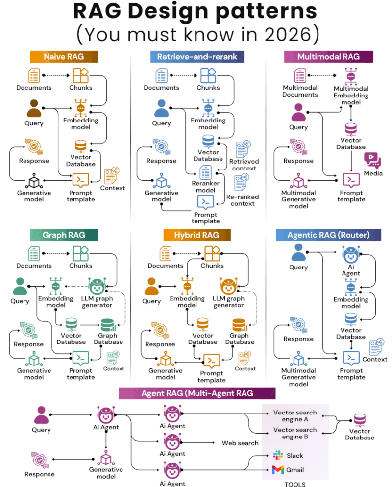
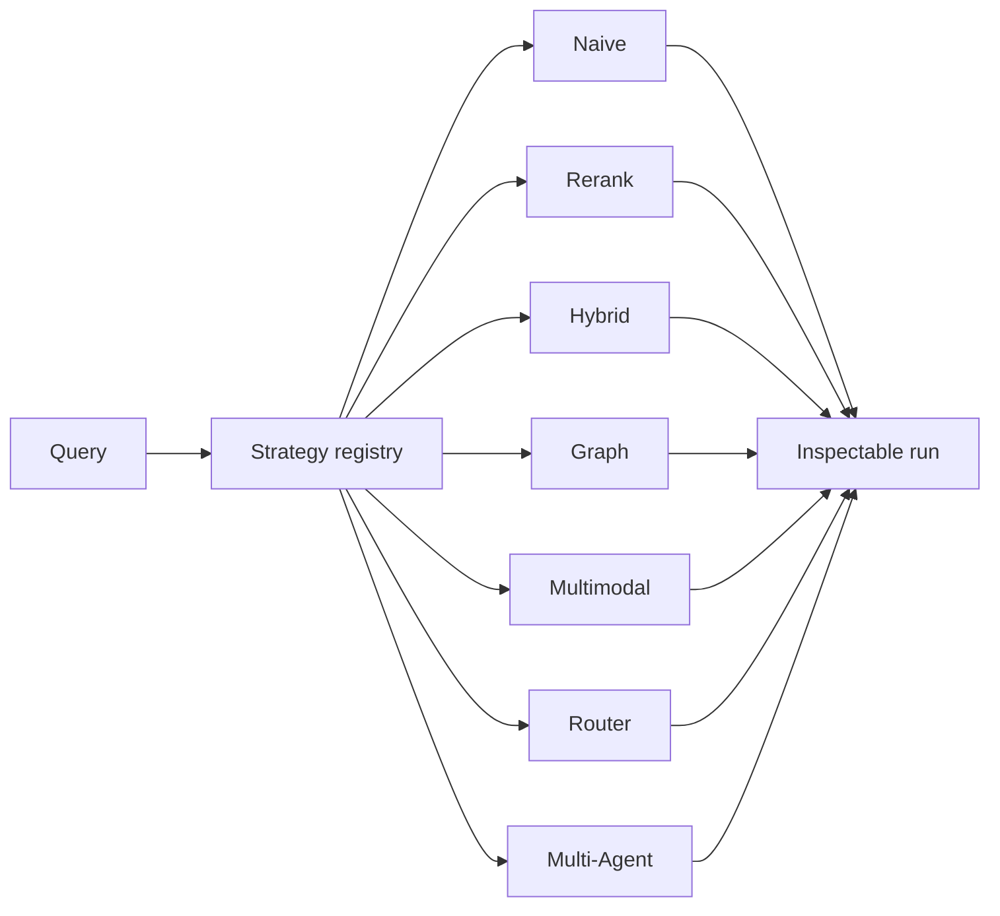

# RAG Systems Laboratory

A local, inspectable laboratory for studying **Retrieval-Augmented Generation** architectures. The goal is not to ship a production chatbot. It is to make retrieval, ranking, routing, and generation visible so you can see how each design changes context, latency, and answers.

The laboratory is LLM-agnostic, embedding-model-agnostic, and vector-store-agnostic. Streamlit is the only UI. Shared infrastructure lives in `core/`. Each architecture is an independent strategy behind a registry. Offline extractive generation, MiniLM embeddings, NumPy or FAISS, and BM25 work without API keys.



*The seven RAG design patterns implemented in this laboratory.*

## Supported architectures

| Architecture | Retrieval path |
|---|---|
| **Naive RAG** | Embed the query, search a vector store, build a prompt, generate |
| **Retrieve-and-Rerank** | Retrieve a wider candidate set, then reorder with a second relevance model |
| **Hybrid RAG** | Combine BM25 and dense search, then fuse with RRF, weighted, or normalized scores |
| **Graph RAG** | Extract entities and relations, traverse the graph, return associated chunks |
| **Multimodal RAG** | Index text and image-caption items; every hit is labeled by modality |
| **Agentic Router** | A structured router chooses `rag`, `memory`, `tool`, or `direct` |
| **Multi-Agent RAG** | A coordinator delegates to document, search, and graph agents, then synthesizes |

**Compare** runs any two registered strategies on the same indexed corpus and the same query. It reports latency, overlap (`A ∩ B`, `A only`, `B only`), answers, and evidence. It does not declare a winner.

## Quick start

```bash
python3 -m venv .venv
source .venv/bin/activate
pip install -r requirements.txt
streamlit run app.py
```

Open the URL Streamlit prints, typically `http://localhost:8501`.

Fastest first run:

1. Click **Try the sample document**.
2. Open **Naive RAG**.
3. Ask: `Why should retrieval be evaluated independently from generation?`
4. Inspect Retrieval, Prompt, Trace, and Metrics.
5. Switch architectures in the sidebar, or open **Compare**.

## Offline mode

No API key is required if you keep the defaults:

| Component | Default |
|---|---|
| Embeddings | `sentence-transformers/all-MiniLM-L6-v2` |
| Dense store | FAISS or NumPy |
| Sparse store | BM25 (built in) |
| Generator | Extractive (offline) |

Optional cloud providers (OpenAI, Anthropic, Gemini, and OpenAI-compatible endpoints such as Ollama, LM Studio, or vLLM) are imported lazily. Copy `.env.example` to `.env` and add only the keys you use. The app still launches if a provider SDK is missing.

Ollama example base URL:

```text
http://localhost:11434/v1
```

## Repository layout

```text
core/              Shared loaders, chunkers, embeddings, stores, fusion, rerankers, generators
rag_strategies/    One package per architecture, plus the strategy registry
ui/                Streamlit pages and inspectors; calls services only
integrations/      Adapters (memory and similar)
tests/             Deterministic, offline pytest
```

`models/` and `rag/` are compatibility shims for older imports.

Naive, Rerank, and Hybrid share loading, chunking, embeddings, stores, prompts, tracing, and generation. Graph, multimodal, and agentic modes reuse that same stack and change only the retrieval or decision path. That is why comparison stays honest: both sides index the same corpus.



## Adding a strategy

1. Implement `RAGStrategy` (`ingest`, `retrieve`, and optionally `generate` / `run`).
2. Depend on injected interfaces (`EmbeddingProvider`, `VectorStore`, `Generator`, and so on). Do not import a provider SDK inside the strategy.
3. Register the class in `rag_strategies/registry.py`.
4. Reuse `ui/pages/laboratory.py` or add a focused inspector.
5. Add deterministic offline tests.

## Limitations

This is a teaching laboratory, not a production RAG stack.

- Graph extraction is heuristic. It is not an LLM entity model.
- Multimodal images are indexed as captions unless a vision embedding is added later. Pixels are not required to run the lab.
- The router uses deterministic rules, not a hidden planner. Memory and web routes are simulated until adapters are connected.
- Multi-agent mode does not write to external systems.
- Offline extractive answers quote retrieved sentences. They are not an LLM.
- Labeled retrieval metrics (Recall@K, nDCG) are not computed unless you supply ground truth.

## Roadmap

- Richer graph extractors behind the same interface
- Optional CLIP or vision embeddings for image vectors
- A memory-simulator adapter for the router
- Labeled evaluation (Precision@K, MRR, nDCG)

## Tests

```bash
pytest -q
```

Tests do not call paid APIs.

## Security

Do not commit `.env` or provider keys. `.env.example` contains placeholders only.
